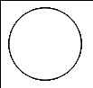
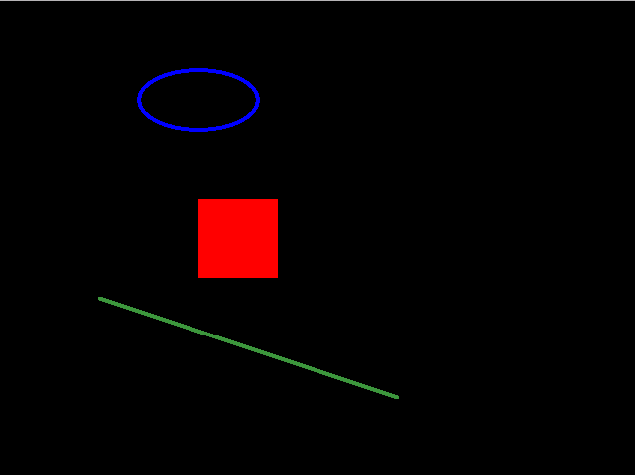
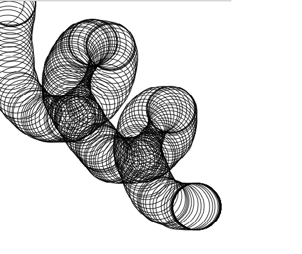
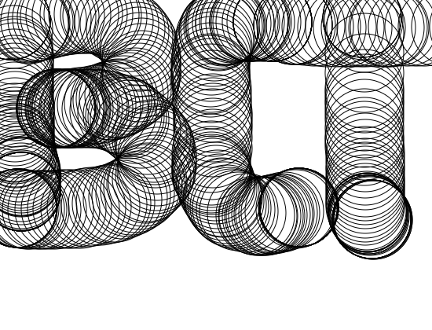
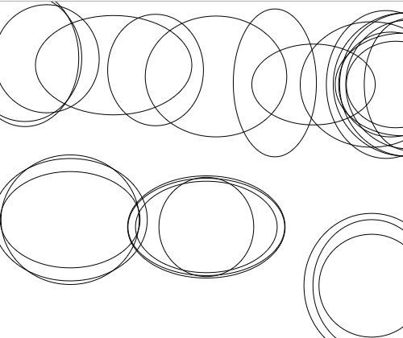
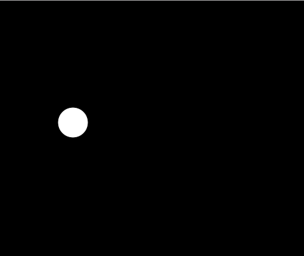
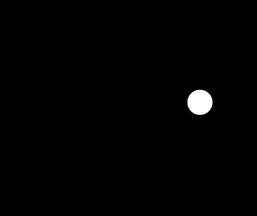
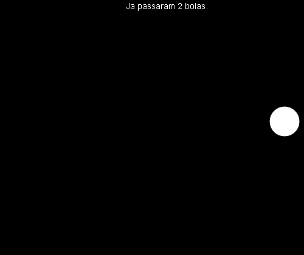
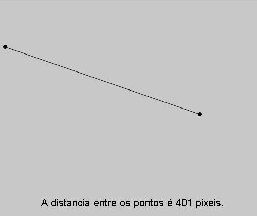

# Começando

## Passo 1: Criando um arquivo html 

Primeiro, você irá precisar de uma página HTML simples, como a mostrada abaixo:

``` html
<html>
<head>
  <meta charset="UTF-8">
  <script language="javascript" type="text/javascript" src="libraries/p5.js"></script>
  <script language="javascript" type="text/javascript" src="Jogo.js"></script>

  <style> body {padding: 0; margin: 0;} </style>
</head>

<body>
</body>
</html>
```
Ela servirá como meio de acesso ao seu arquivo de script, salve-a como "index.html".

Alternativa:

``` html
<html>
<head>
  <meta charset="UTF-8">
  <script language="javascript" type="text/javascript" src="https://github.com/processing/p5.js/releases/download/0.5.16/p5.js"></script> //mudança
  <script language="javascript" type="text/javascript" src="Jogo.js"></script>

  <style> body {padding: 0; margin: 0;} </style>
</head>

<body>
</body>
</html>
```

Neste exemplo, a biblioteca p5.js foi substituída por um link que contem seu diretório na web, isso permite que execumentos qualquer código sem ter a biblioteca baixada.


## Passo 2: Criando uma arquivo de código JavaScript 

Abra o editor de sua preferência e digite o seguinte:
``` javascript
function setup() {

}

function draw() {
  ellipse(50, 50, 80, 80);
}
```
Salve este arquivo como *Jogo.js* (mesmo nomo usado dentro do arquivo HTML). 

O resultado da execução do arquivo index.html será: 



Para mais informações veja: 

* https://p5js.org/reference/#/p5/ellipse 

Um exemplo de código funcionando com processing web (p5.js) pode ser baixado em: https://github.com/orivaldosantana/ECT2203LoP/blob/master/lab0/lab_processing_intro.zip 

## Passo 3: Desenhando formas geométricas 

O processing tem diversas funções para desenho de formas, tais como `ellipse()`, `rect()`, `line()`, `point()`, `quad()`, `triangle()`... Todas elas precisam de informações como posição e tamanho, que são colocadas dentro dos parênteses.

No caso do código acima, uma elipse é desenhada na tela. Para isso, temos que informar as coordenadas e o tamanho da elipse usando *ellipse([coordenada x],[coordenada y], [largura], [altura])*. Salve o arquivo com o nome "Jogo.js" e abra o index no navegador.

Podemos também, brincar com a aparência dessas formas. No seu script, digite o seguinte:
``` javascript
function setup() {
	createCanvas(640, 480);
	background(0);
}

function draw() {
  noFill();
  stroke(0, 0, 255);
  ellipse(200, 100, 120, 60);
  noStroke();
  fill(255, 0, 0);
  rect(200, 200, 80, 80);
  stroke(60, 150, 60);
  strokeWeight(3);
  line(100, 300, 400, 400);
}
```
Resultado da execução:



A função createCanvas() define o tamanho da tela e o background() define sua cor de fundo. As funções fill() e stroke(), definem as cores de preenchimento e de contorno, respectivamente. Uma vez utilizadas essas funções, seus efeitos valerão para todas as formas declaradas abaixo. noFill() e noStroke(), retiram o preenchimento e o contorno, respectivamente, e strokeWeight() define uma espessura para o contorno da forma.
  
 Veja:
 
 * https://p5js.org/reference/#/p5/rect
 * https://p5js.org/reference/#/p5/line
 * https://p5js.org/reference/#/p5/fill
 * https://p5js.org/reference/#/p5/noFill
 * https://p5js.org/reference/#/p5/stroke
 * https://p5js.org/reference/#/p5/noStroke
 * https://p5js.org/reference/#/p5/createCanvas
  
Agora vejamos algo mais interessante...

Primeiro teremos que saber o que são as funções setup() e draw(), que viemos utilizando aqui. Elas são usadas basicamente para organizar o fluxo do código. O setup(), é executado apenas uma vez, no começo, para declarações iniciais. Já o draw(), ficará se repetindo no decorrer da execução, nele poderemos fazer algo mudar seu valor ao longo do tempo. Um exemplo é a posição da ellipse, que pode ser alterada de acordo com a posiço do mouse!

Veja:

* https://p5js.org/reference/#/p5/setup
* https://p5js.org/reference/#/p5/draw

Delete o script anterior e digite o seguinte: 

``` javascript
function setup() {
  createCanvas(640, 480);
  noFill();
}

function draw() {
  ellipse(mouseX, mouseY, 80, 80);
}
```
Resultado da execução:



Os parâmetros mouseY e mouseX, funcionam como variáveis que armazenam os valores da posição do mouse.

Veja:

* https://p5js.org/reference/#/p5/mouseX
* https://p5js.org/reference/#/p5/mouseY

Agora vamos implementar um pouco esse código.

``` javascript
function setup() {
  createCanvas(640, 480);
  noFill();
}

function draw() {
  if (mouseIsPressed){
    ellipse(mouseX, mouseY, 100, 100);
  }
}

```



A variável mouseIsPressed é uma boleana, nela é armazenado true para o caso de o botão do mouse estar sendo pressionado e false para o caso do botão estar solto.

Veja: 

* https://p5js.org/reference/#/p5/mouseIsPressed

A função random(min, max) também pode ser muito útil para diversas aplicações.
	
``` javascript
function setup() {
  createCanvas(640, 480);
  noFill();
}

function draw() {
  if (mouseIsPressed){
    ellipse(mouseX, mouseY, random(100, 200), random(100, 200));
  }
}

```



Veja:

* https://p5js.org/reference/#/p5/random

Também podemos criar nossas próprias variáveis.

``` javascript
var posX, posY;

function setup() {
  createCanvas(640, 480);
  posX = 0;
  posY = 200;
}

function draw() {
  background(0);
  if (posX < 640){
	posX = posX + 15;
  }else{
	posX = 0;
  }
  ellipse(posX, posY, 50, 50);
}
```

 

Aqui, criamos as variáveis antes das funções, para que elas possam ser usadas em todos os lugares do código. No setup(), damos valores iniciais, visto que o setup só é executado uma única vez. No draw(), verificamos se a posição X do círculo está dentro do nosso canvas, se está verdadeiro, a variável da posição X é incrementada fazendo com que o círculo ande pela tela na horizontal, se ele sai do canvas, a posição X volta para zero (0) e o ciclo recomeça. O background está sendo repintado no draw() para evitar que o círculo deixe um rastro na tela; primeiro é pintado um fundo, depois o círculo é pintado em uma posição X, depois o fundo é pintado novamente e só então um novo círculo é pintado, em uma nova posição X. Experimente retirar a função background e veja o que acontece.

```javascript
var x = 100;
var y = 100;

function setup() {
  createCanvas(512, 512);
}

function draw() {
  background(0);
  if (keyIsDown(LEFT_ARROW))
    x-=5;

  if (keyIsDown(RIGHT_ARROW))
    x+=5;

  if (keyIsDown(UP_ARROW))
    y-=5;

  if (keyIsDown(DOWN_ARROW))
    y+=5;
	
  ellipse(x, y, 50, 50);
}
```
Neste código, utilizamos entradas do teclado para alterar os valores das variáveis criadas. Isso é feito atravéz da função keyIsDown(), que retorna true sempre que uma tecla com o mesmo código que foi passado como parâmetro na função estiver sendo pressionada, e false caso contrário. Você poderá usar o número que representa a tecla ou o próprio nome reservado para ela como: BACKSPACE, DELETE, ENTER, RETURN, TAB, ESCAPE, SHIFT, CONTROL, OPTION, ALT, UP_ARROW, DOWN_ARROW, LEFT_ARROW, RIGHT_ARROW. Para saber o número que representa qualquer tecla, veja: http://keycode.info/. 

Veja: 

* https://p5js.org/reference/#/p5/keyIsDown.

Vejamos agora mais algumas aplicações da função random().
```javascript
var yo, xo;

function setup() {
  createCanvas(512, 512);
  yo = random(512); 
  xo = random(512);
}

function draw() {
  background(0);
  
  if(mouseIsPressed) {
		yo = random(512);
		xo = random(512);
  }
  
  rect(xo,yo,40,40);
}
```

Neste código, a função foi utilizada para definir uma posição aleatória para um retangulo, dentro do nosso canvas, sempre que o botão do mouse for pressionado. Observe que passamos apenas um valor como parâmetro, tal valor é interpretado como o valor máximo e o número escolhido estará na faixa [0, max]. Poderiamos também definir a posição do retangulo para fora do canvas, e faze-lo aparecer utilizando o sistema de movimentação que já vimos antes.

```javascript
var yo, xo;

function setup() {
   createCanvas(512, 512);
   yo = random(512); 
   xo = -random(512);
}

function draw() {
   background(0);
  
   xo += 10;
  
   if(xo > width) {
     yo = random(512);
     xo = -random(512); 
   }
  
   rect(xo,yo,40,40);
   ellipse(x, y, 50, 50);
}
```
Note que após o retangulo sair da área do nosso canvas, devemos definir as posições novamente, para que ele volte a aparecer no começo da tela.

Veja:

* https://p5js.org/reference/#/p5/random

Introduziremos agora o conceito de *variáveis de estado*. Utilizar variáveis de estado é muito útil para quando precisamos que algo aconteça no programa somente quando alguma outra ação estiver sendo realizada. Por exemplo, você só poderá fazer provas de C2 enquanto a *variável* "cursando C2" estiver ativada, uma vez que essa variável seja desligada você não poderá mais fazer provas de C2 a não ser que "cursando C2" seja ligada novamente ('-'). Para criar uma variável de estado utilizamos as variáveis boleanas, pois estas possuem dois estados, *true* e *false*, que são usados para representar *ligado* e *desligado*.

Vejamos um exemplo prático dessas variáveis de estado.

```javascript
var yo, xo;
var naTela = true;
function setup() {
  createCanvas(512, 512);
  yo = random(512); 
  xo = 15;
}

function draw() {
  background(0);
  
  if(naTela){
    xo += 15;
  }else{
    yo = random(512); 
    xo = 15;
    naTela = true;
  }
  
  if(xo > width) {
	naTela = false;
  }
  
  rect(xo,yo,40,40);
}
```

Aqui, a variável boleana naTela funciona como variável de estado, pois observe que enquanto o retângulo permanecer dentro da área do canvas, naTela é verdadeira e o retângulo anda para a direita, uma vez que este saia da tela, naTela vira falso e o retângulo volta para o começo da tela. Em resumo, podemos ler que o retângulo andará quando naTela for verdadeiro e voltará para o começo da tela quando naTela for falso. Vejamos outro exemplo.

```javascript
var yo, xo;
var podeMudar = true;
function setup() {
  createCanvas(512, 512);
  yo = random(512); 
  xo = 15;
}

function draw() {
  background(0);
  
  if(!podeMudar){
     xo += 15;
  }
  
  if(xo > width){
	podeMudar = true;
  }
  
  if(mouseIsPressed && podeMudar) {
      yo = random(512); 
      xo = 15;
    podeMudar = false;
  }
  
  rect(xo,yo,40,40);
}
```

Aqui a variável de estado é podeMudar. O programa funciona da seguinte forma: quando o mouse é clicado, uma posição é definida para o retângulo que logo então começará a andar para a direita, uma vez em movimento, o clique do mouse não conseguirá mais mudar sua posição até que ele saia da área do canvas. Assim, quando o retângulo estiver fora de vista, podeMudar é verdadeira e a posição poderá ser alterada com um clique do mouse, mas uma vez em movimento, até que o retângulo saia de vista novamente, podeMudar será falsa e o clique do mouse não funcionará. 

Em alguns casos, precisaremos escrever algo na nossa tela, podemos fazer isso usando a função text(), desse modo:

```javascript
var posX, posY;
var contagem = 0;
function setup() {
  createCanvas(640, 480);
  posX = 0;
  posY = 200;
}

function draw() {
  background(0);
  
  textSize(14); // define o tamanho da fonte
  fill(255); 
  text("Ja passaram " + contagem + " bolas.", 250, 15); // escreve na tela, note que podemos imprimir o valor de variáveis.
  
  if (posX < 640){
	posX = posX + 15;
  }else{
	contagem++;
	posX = 0;
  }
  ellipse(posX, posY, 50, 50);
}
```

Saída: 



Outra função bastante utilizada é a dist(x1, y1, x2, y2), que retorna a distancia entre duas posições informadas. Podemos utiliza-la de diversas formas, veremos um exemplo aqui.

``` javascript
var x1 = 10;
var y1 = 90;

function setup(){
	createCanvas(500, 420);
}

function draw() {
  background(200);
  fill(0);

  var x2 = mouseX;
  var y2 = mouseY;

  line(x1, y1, x2, y2);
  ellipse(x1, y1, 7, 7);
  ellipse(x2, y2, 7, 7);

  var d = int(dist(x1, y1, x2, y2));
  textSize(20);
  text("A distancia entre os pontos é " + d + " pixeis.", 80, 400);
}
```

Saída: 




Adicionando uma musica ao seu código:


```  html

<html>
<head>
  <meta charset="UTF-8">
  <script language="javascript" type="text/javascript" src="https://github.com/processing/p5.js/releases/download/0.5.16/p5.js"></script>
  <script language="javascript" type="text/javascript" src="jogo.js"></script>
<embed name="musica" src="musica.mp3" loop="true" hidden="true" autostart="true"> //mudança


  <style> body {padding: 0; margin: 0;} </style>
</head>

<body>
</body>
</html>

	
```
Foi adicionado uma linha de código com:
```	
<embed name="musica" src="musica.mp3" loop="true" hidden="true" autostart="true">
```
Isso permite que importemos o arquivo "musica.mp3" do nosso diretório;

também podemos importar uma musica da web utilizando endereço URL da musica, por exemplo:

<html>
<head>
  <meta charset="UTF-8">
  <script language="javascript" type="text/javascript" src="https://github.com/processing/p5.js/releases/download/0.5.16/p5.js"></script>
  <script language="javascript" type="text/javascript" src="jogo.js"></script>
<embed name="musica" src="http://66.90.93.122/ost/dragon-ball-revenge-of-king-piccolo-2009/chgpgoboug/BGM%20001.mp3" loop="true" hidden="true" autostart="true"> //mudança


  <style> body {padding: 0; margin: 0;} </style>
</head>

<body>
</body>
</html>


Por enquanto, pode parecer que não fizemos algo muito interessante, mas essa é só uma base para que você possa criar coisas incríveis. Para isso, basta praticar os conceitos aqui mostrados e juntar-los ao que vocè aprender em suas pesquisas futuras. Um ótimo lugar para expandir seu conhecimento sobre esse assunto é o próprio site do Processing. Divirta-se!

Saiba mais em: 
* https://p5js.org/
